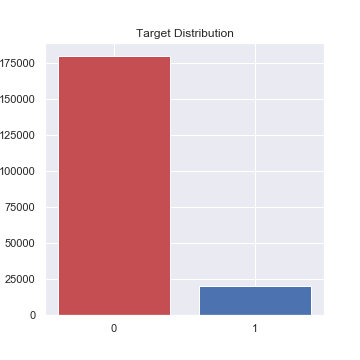
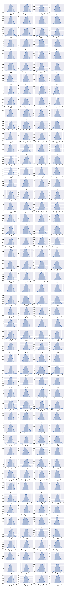
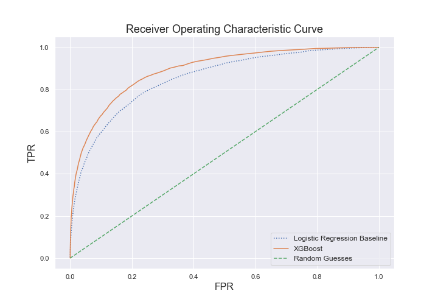
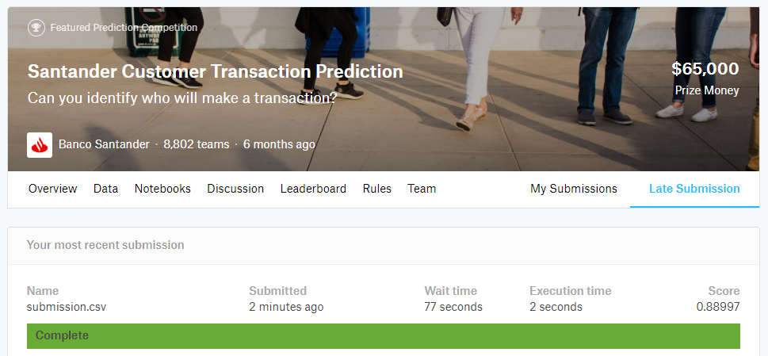

# **Machine Learning Engineer Nanodegree**
## **Capstone Project**
Éderson André de Souza

October 12, 2019

## **I. Definition**
<!-- _(approx. 1-2 pages)_ -->

### **Project Overview**
<!-- In this section, look to provide a high-level overview of the project in layman’s terms. Questions to ask yourself when writing this section:
- _Has an overview of the project been provided, such as the problem domain, project origin, and related datasets or input data?_
- _Has enough background information been given so that an uninformed reader would understand the problem domain and following problem statement?_ -->

It is not unusual to hear a company's management speak about forecasts: "Our sales did not meet the forecasted numbers," or "we feel confident in the forecasted economic growth and expect to exceed our targets." You cannot predict the future of your business, but you can reduce risk by eliminating the guesswork. With accurate forecasting, you can make a systematic attempt to understand future performance. This will allow you to make better informed decisions and become more resistant to unforeseen financial requirements.
Without correctly estimating financial requirements and understanding changing markets, your business decisions will be guess work which can result in insufferable damage.

So, with that in mind, without doubt, it is very important to help business forecasting future products and services demands.

And because of that, I chose the Santander Customer Transaction Prediction dataset to try building a model that can consistently handle this task.

In this project, I trained and tested a binary classifier capable of predicting the probability of a customer make a specific transaction in the future. The model used the gradient boosting algorithm, and was trained on the data provided for [their Kaggle competition](https://www.kaggle.com/c/santander-customer-transaction-prediction/data).

### **Problem Statement**
<!-- In this section, you will want to clearly define the problem that you are trying to solve, including the strategy (outline of tasks) you will use to achieve the desired solution. You should also thoroughly discuss what the intended solution will be for this problem. Questions to ask yourself when writing this section:
- _Is the problem statement clearly defined? Will the reader understand what you are expecting to solve?_
- _Have you thoroughly discussed how you will attempt to solve the problem?_
- _Is an anticipated solution clearly defined? Will the reader understand what results you are looking for?_ -->

Banco Santander, S.A., doing business as Santander Group, is a Spanish multinational commercial bank and financial services company based in Madrid and Santander in Spain. Additionally, Santander maintains a presence in all global financial centres as the 16th-largest banking institution in the world. Although known for its European banking operations, it has extended operations across North and South America, and more recently in continental Asia. [Wikipedia](https://en.wikipedia.org/wiki/Banco_Santander)

In their [Kaggle competition](https://www.kaggle.com/c/santander-customer-transaction-prediction), Santander provided an anonymized dataset containing numeric feature variables, the binary target column, and a string ID_code column; the goal is to build a model that predicts the probability of a customer make a specific transaction in the future.

To solve this problem, firstly I attained some basic understanding of the training data that was provided to check for characteristics such as target concept balance and distribution of features; Then, I used a classification model based on the well known Logistic Regression as my baseline model for comparison. The final model is build on a gradient boosting framework, The XGBoost. I also have decided to evaluate the amount of data used, and performed parameter tuning for the GB model. Lastly, I tested the final model design using its performance on the given testing data.

### **Metrics**
<!-- In this section, you will need to clearly define the metrics or calculations you will use to measure performance of a model or result in your project. These calculations and metrics should be justified based on the characteristics of the problem and problem domain. Questions to ask yourself when writing this section:
- _Are the metrics you’ve chosen to measure the performance of your models clearly discussed and defined?_
- _Have you provided reasonable justification for the metrics chosen based on the problem and solution?_ -->

Following [Kaggle's competition metrics](https://www.kaggle.com/c/santander-customer-transaction-prediction/overview/evaluation), a model is graded based on the area-under-the-ROC-curve score between the predicted class probability and the observed target, measured on the test data. Since the test data is not labelled, grading is done by uploading the file containing the probability of each transaction in the test data to Kaggle.

> ROC (Receiver Operating characteristic) curve is a graph showing the performance of a classification model at all classification thresholds. This curve plots two parameters:
* True Positive rate
* False Positive rate

> AUC stands for "Area under the ROC Curve." That is, AUC measures the entire two-dimensional area underneath the entire ROC curve (think integral calculus) from (0,0) to (1,1).

[source: Google](https://developers.google.com/machine-learning/crash-course/classification/roc-and-auc)

Using the ROC-AUC metric, we can see the closeness between the model's prediction on the testing set and that of the solution, showing how accurate the model is in terms of classification probability. Furthermore, ROC-AUC can tell how good the classifier is at separating the positive and negative. While , ROC-AUC is a quick and intuitive way of assessing the model's performance compared to the solution.

In my opinion, another reason why ROC-AUC was chosen to measure classifier performance in this competition instead of for example simple accuracy metric, is because of its sensitivity towards True Positive and False Positive. As you may notice, accuracy don't work well for imbalanced datasets.

## **II. Analysis**
<!-- _(approx. 2-4 pages)_ -->

### **Data Exploration**
<!-- In this section, you will be expected to analyze the data you are using for the problem. This data can either be in the form of a dataset (or datasets), input data (or input files), or even an environment. The type of data should be thoroughly described and, if possible, have basic statistics and information presented (such as discussion of input features or defining characteristics about the input or environment). Any abnormalities or interesting qualities about the data that may need to be addressed have been identified (such as features that need to be transformed or the possibility of outliers). Questions to ask yourself when writing this section:
- _If a dataset is present for this problem, have you thoroughly discussed certain features about the dataset? Has a data sample been provided to the reader?_
- _If a dataset is present for this problem, are statistics about the dataset calculated and reported? Have any relevant results from this calculation been discussed?_
- _If a dataset is **not** present for this problem, has discussion been made about the input space or input data for your problem?_
- _Are there any abnormalities or characteristics about the input space or dataset that need to be addressed? (categorical variables, missing values, outliers, etc.)_ -->

The dataset provided by Santander on [Kaggle competition](https://www.kaggle.com/c/santander-customer-transaction-prediction/data) includes approximately 400 thousand customers, split equally into training and testing sets. So, the training set contains 200 thousand rows of data, each has 200 numbered features (columns) without any description, an ID_code column and a binary target, which is whether that customer did a transaction or not. The testing set contains the same amount of data, 200 thousand rows, and the main difference between them is that in the test set there is no target.

**Files:**
* train.csv (288.33 MB): the training data
* test.csv (287.75 MB): the test data
* sample_submission.csv (2822 KB): submission model

**Line counts:**
* train.csv: 200,000
* test.csv: 200,000

**Feature Descriptions:**
* On both sets:
  * `var_0` to `var_199` (float): no description about them.
  * `ID_code` (string): row identification. 

* Training set:
  * `target`: whether customer did a transaction or not; 1 - yes, 0 - no

**Observations:**
* The data is very imbalanced with only 10.049% positive (customers that made a transaction). And because of that *Accuracy Score* doesn't work well here. If we guess that all customers won't make the transaction, our *Accuracy* would be 89.951%, pretty impressive, no? **Not at all**.
* All features were previously normally distributed.
* There aren't missing values in the data.
* Basic Statitics:
    * *Mean*: The Mean of the values stays between -16.55 -> 24.52.
    * *Median*: Because the distribution of the features was normalized, the Median range is almost like the Mean: -16.48 -> 24.45.
    * *Standard Deviation*: 0.01 -> 21.40.
    * *Min*: Range -90.25 -> 13.73
    * *Max*: Range 1.00 -> 74.03  
* There is no strong correlation between features.
    * Strongest Positive Correlation: 0.0097
    * Strongest Negative Correlation: -0.0098

### **Exploratory Visualization**
<!-- In this section, you will need to provide some form of visualization that summarizes or extracts a relevant characteristic or feature about the data. The visualization should adequately support the data being used. Discuss why this visualization was chosen and how it is relevant. Questions to ask yourself when writing this section:
- _Have you visualized a relevant characteristic or feature about the dataset or input data?_
- _Is the visualization thoroughly analyzed and discussed?_
- _If a plot is provided, are the axes, title, and datum clearly defined?_ -->

The plot below shows the distribution of the target in the training set:

This may need to be taken into consideration later when the classification model is chosen.

Let's visualize the feature distributions:

As mentioned above, all features show distributions like Normal.

### **Algorithms and Techniques**
<!-- In this section, you will need to discuss the algorithms and techniques you intend to use for solving the problem. You should justify the use of each one based on the characteristics of the problem and the problem domain. Questions to ask yourself when writing this section:
- _Are the algorithms you will use, including any default variables/parameters in the project clearly defined?_
- _Are the techniques to be used thoroughly discussed and justified?_
- _Is it made clear how the input data or datasets will be handled by the algorithms and techniques chosen?_ -->

**Extreme Gradient Boosting (XGBoost)** is an implementation of the gradient boosting machines that is highly flexible and versatile while being scalable and fast. XGBoost works with most regression, classification, and ranking problems as well as other objective functions; the framework also gained its popularity in recent years because of its compatibility with most platforms and distributed solutions like Amazon AWS, Apache Hadoop, Spark among others.

In short, XGBoost is a variation of boosting - an ensemble method algorithm that tries to fit the data by using a number of "weak" models, typically decision trees. The idea is that a "weak" classifier which only performs slightly better than random guessing can be improved ("boosted") into a "stronger" one that is arbitrarily more accurate. Building on the weak learners sequentially, at every round each learner aims to reduce the bias of the whole ensemble of learners, thus the weaker learners eventually combined into a powerful model. This idea gave birth to various boosting algorithms such as AdaBoost, Gradient Tree Boosting, etc.

XGBoost is an example of gradient boosting model, which is built in stages just like any other boosting method. In gradient boosting, weak learners are generalized by optimizing an arbitrary loss function using its gradient.

> XGBoost, as a variation of boosting, features a novel tree learning algorithm for handling sparse data; a theoretically justified weighted quantile sketch procedure enables handling instance weights in approximate tree learning.
<a href= 'https://cseweb.ucsd.edu/~yfreund/papers/IntroToBoosting.pdf'>Reference 01 </a>
<a href= 'http://www.cs.princeton.edu/~schapire/papers/strengthofweak.pdf'>Reference 02 </a>
<a href= 'http://dmlc.cs.washington.edu/data/pdf/XGBoostArxiv.pdf'>Reference 03 </a>

There is a number of advantages in using XGBoost over other classification methods:
* **Work with large data:** XGBoost packs many advantageous features to facilitate working with data of enormous size that typically can't fit into the system's memory such as distributed or cloud computing. It is also implemented with automatic handling of missing data (sparse) and allows continuation of training, or batch training.
* **Built-in regularization:** XGBoost supports several options when it comes to controlling regularization and keeping the model from overfitting, including gamma (minimum loss reduction to split a node further), L1 and L2 regularizations, maximum tree depth, minimum sum of weights of all observations required in a child, etc.
* **Optimization for both speed and performance:** XGBoost provides options to reduce computation time while keeping model accuracy using parallelization with multi-core CPU, cache optimization, and GPU mode that makes use of the graphics unit for tree training.

### **Benchmark**
<!-- In this section, you will need to provide a clearly defined benchmark result or threshold for comparing across performances obtained by your solution. The reasoning behind the benchmark (in the case where it is not an established result) should be discussed. Questions to ask yourself when writing this section:
- _Has some result or value been provided that acts as a benchmark for measuring performance?_
- _Is it clear how this result or value was obtained (whether by data or by hypothesis)?_ -->

For the baseline benchmark, I have randomly predicted with 10% probability (the distribution of the training set) that a customer will make a transaction. This method yields an AUC score of ~ 0.50 on the submission to Kaggle. This is equivalent to guess that all customers will not make the transaction, which is very bad and naive.

So, if the final model results in an AUC score better than the 0.50, we have succeeded.

Because of this naive approach, I have decided to bring a Baseline Model for benchmark too. It is Logistic Regression,  one of the simplest classification models in the toolbox of any Data Scientist. This problem has a binary target, so Logistic Regression can be applied. LR is easy to implement, tune, update and interpret.
    
<a href='https://elitedatascience.com/machine-learning-algorithms'>Reference 01 </a>
<a href='https://towardsdatascience.com/real-world-implementation-of-logistic-regression-5136cefb8125'>Reference 02 </a>    <a href='https://towardsdatascience.com/real-world-implementation-of-logistic-regression-5136cefb8125'>Reference 03 </a>    <a href='https://www.dataschool.io/comparing-supervised-learning-algorithms/'>Reference 04 </a>

So, in the end, our main goal is to beat the Logistic Regression Model AUC, which is 0.8603 on the validation subset, using about 50% of the dataset (we will discuss sample size in the next section).

Just for clarification, the train dataset was split into train and validation subsets. The train subset got 80% of the data and validation got the 20% left. 

## **III. Methodology**
<!-- _(approx. 3-5 pages)_ -->

### **Data Preprocessing**
<!-- In this section, all of your preprocessing steps will need to be clearly documented, if any were necessary. From the previous section, any of the abnormalities or characteristics that you identified about the dataset will be addressed and corrected here. Questions to ask yourself when writing this section:
- _If the algorithms chosen require preprocessing steps like feature selection or feature transformations, have they been properly documented?_
- _Based on the **Data Exploration** section, if there were abnormalities or characteristics that needed to be addressed, have they been properly corrected?_
- _If no preprocessing is needed, has it been made clear why?_ -->

As partially mentioned, the given dataset had already been well-prepared and processed, all categorical features had been labelled and set to binary numbers, features normalized, and potentially missing data had been either filled or discarded.

#### **Feature engineering**

In my opinion, the hardest task in this project was feature engineering.  
The main reason is that there is no explanation about the features. All of them are meaningless numbers and without correlation. And for leaving this task even harder, there are 200 features, which demand a lot of computational power to work with.
So, I didn't make any feature engineering in this project.

#### **Feature Scaling and Data Sampling**

As you may notice at Data Exploration, each feature has its own range of values, and good practice is to bring all features to the same level of magnitudes with Feature Scaling.

There are many techniques to handle this job like Rescaling (min-max normalization), Mean normalization, Standardization, Scaling to unit length and others.

However, I have chosen Standardization, which makes the values of each feature in the data have zero-mean and unit-variance. The main reason for choosing Standardization is because this method is widely used in many machine learning algorithms and it is very effective for Logistic Regression.

For Tree-based models like XGBoost, Feature Scaling is not required, but I have used to try speed up the calculations.

<a href= 'https://medium.com/greyatom/why-how-and-when-to-scale-your-features-4b30ab09db5e'>Reference 01</a>
<a href= 'https://en.wikipedia.org/wiki/Feature_scaling'>Reference 02</a>

In order to save computational power and time, I have tested the baseline model with Stratified Samples of the training set. The sample size started at 10% and was incremented by 10% every test until 100%, meaning the entire dataset.

Plotting results obtained, we can see that the best result (AUC = 0.8623) came from 70% of the dataset size and using only 50% of it also shown a very good result (AUC = 0.8599).

Another big advantage of using a stratified sample of the data was time-saving. Training with 70% of the dataset saved about 35% of the time, and 50% of the dataset saved about 55% of the time to train the model.

Given that, the final model will be trained using only 50% of the dataset.

#### **Handling Imbalanced Dataset**

As we saw earlier, the training data set is very imbalanced. Only 10.049% of the target is positive.     
An approach to this problem is oversampling.
Oversampling can be defined as adding more copies of the minory class based upon the existing observations. <a href='https://en.wikipedia.org/wiki/Oversampling_and_undersampling_in_data_analysis'>Reference</a>

In this case, I have applied a technique called SMOTE. What it does is: *"First it finds the n-nearest neighbors in the minority class for each of the samples in the class . Then it draws a line between the the neighbors an generates random points on the lines"*. <a href='https://medium.com/coinmonks/smote-and-adasyn-handling-imbalanced-data-set-34f5223e167'>Reference</a>

Applying SMOTE on the Baseline Model, it was not observed any improvement on AUC Score, but the big impact was on Recall Score. It jumped from 0.246854 to 0.769603, which means that 76.62% of the positive targets were detected. Therefore, in case Santander needs to predict all transactions as possible, the higher the Recall Score is, the better.

At the XGBoost final model, the oversampling technique is already inside the hyperparameters (scale_pos_weight). Therefore, SMOTE package won't be used.

### **Implementation**
<!-- In this section, the process for which metrics, algorithms, and techniques that you implemented for the given data will need to be clearly documented. It should be abundantly clear how the implementation was carried out, and discussion should be made regarding any complications that occurred during this process. Questions to ask yourself when writing this section:
- _Is it made clear how the algorithms and techniques were implemented with the given datasets or input data?_
- _Were there any complications with the original metrics or techniques that required changing prior to acquiring a solution?_
- _Was there any part of the coding process (e.g., writing complicated functions) that should be documented?_ -->

The software requirement for the implementation is as followed:
* Python >= 3.7
* numpy >= 1.16.5
* pandas >= 0.25.1
* scikit-learn >= 0.21.3
* xgboost >= 0.90
* hyperopt >= 0.2 

I first attempted to train an XGBoost model right of the box, without tuning. Then, I planned to compare the performance to the same model trained with hyperparameter tuning.  In the first attempt, the only hyperparameter passed was `n_jobs = -1` to force using all CPU cores.

The AUC Score obtained was 0.8306 on the validation subset, which is not good compared with our baseline model, Logistic Regression.

Let's tune the model to see if we can get a better result.

### **Refinement**
<!-- In this section, you will need to discuss the process of improvement you made upon the algorithms and techniques you used in your implementation. For example, adjusting parameters for certain models to acquire improved solutions would fall under the refinement category. Your initial and final solutions should be reported, as well as any significant intermediate results as necessary. Questions to ask yourself when writing this section:
- _Has an initial solution been found and clearly reported?_
- _Is the process of improvement clearly documented, such as what techniques were used?_
- _Are intermediate and final solutions clearly reported as the process is improved?_ -->

#### **Hyperparameter tuning**

The refinement process started with hyperparameter tuning. To handle this task I have decided to use Hyperopt package.

Hyperopt uses Bayesian Optimization which combines randomness and posterior probability distribution in searching the optimal parameters. In contrast, GridSearch from SKLearn uses purely random methodology, which is not the smart way. <a href='https://towardsdatascience.com/an-example-of-hyperparameter-optimization-on-xgboost-lightgbm-and-catboost-using-hyperopt-12bc41a271e'>Reference</a>

The optimized parameters were:

* `gamma`:
  * Minimum loss reduce for each node split
  * Search values: [5..10]
* `min_child_weight`:
  * Minimum sum of weights of all observations required in a child node
  * Used to avoid overfitting as higher values prevent model to learn relations specific to the dataset
  * Search values: [1..5]
* `subsample`:
  * Subsample ratio of the training instances
  * Search values: [0.5..1.0]
* `colsample_bytree`:
  * Control the amount of features to be sampled by each tree
  * Search values: [0.2, 0.9]
* `reg_alpha`:
  * L1 regularization
  * Search values: [0.1..1.0]
* `scale_pos_weight`:
  * Control the balance of positive and negative weights, useful for unbalanced classes.
  * Search values: [8..10]

Running 500 evaluations the best parameters found were:

* `colsample_bytree`: 0.2
* `gamma`: 9.0
* `min_child_weight`: 4.0
* `reg_alpha`: 0.35
* `scale_pos_weight`: 8.920569929381536,
* `subsample`: 0.55

For the final model it was added the following parameters:

* `learning rate`: 0.2
  *  Step size shrinkage used in update to prevents overfitting.
* `max_depth`: 2
  * Maximum depth of a tree. Increasing this value will make the model more complex and more likely to overfit.
* `objective`: "binary:logistic"
  * Logistic Regression for binary classification, output probability
* `tree_method`: 'gpu_hist'
  * Fast histogram optimized approximate greedy algorithm. It uses some performance improvements such as bins caching.
  * GPU acceleration.
* `verbosity`: 0
  * Verbosity of printing messages.

## **IV. Results**
<!-- _(approx. 2-3 pages)_ -->

### **Model Evaluation and Validation**
<!-- In this section, the final model and any supporting qualities should be evaluated in detail. It should be clear how the final model was derived and why this model was chosen. In addition, some type of analysis should be used to validate the robustness of this model and its solution, such as manipulating the input data or environment to see how the model’s solution is affected (this is called sensitivity analysis). Questions to ask yourself when writing this section:
- _Is the final model reasonable and aligning with solution expectations? Are the final parameters of the model appropriate?_
- _Has the final model been tested with various inputs to evaluate whether the model generalizes well to unseen data?_
- _Is the model robust enough for the problem? Do small perturbations (changes) in training data or the input space greatly affect the results?_
- _Can results found from the model be trusted?_ -->

With the model properly tuned, it is ready to finally be trained.

To assure the results and evaluate the robustness and generalization, one best practice is to use K-Fold Cross Validation (CV).

Usually, we split the data set into training and testing sets (as we did) and use the training set to train the model and testing set to test the model. Then, we evaluate the model based on an error metric to determine the accuracy of the model. This method however, is not very reliable as the accuracy obtained for one test set can be very different to the accuracy obtained for a different test set. K-fold Cross Validation (CV) provides a solution to this problem by dividing the data into folds and ensuring that each fold is used as a testing set at some point. <a href='https://medium.com/datadriveninvestor/k-fold-cross-validation-6b8518070833'>Reference</a>

I have used `RepeatedStratifiedKFold` from SKLearn Library to apply Cross Validation. The parameters passed was:
* `n_splits` = 4 
  * Number of folds or buckets.
  * 4 buckets of data: 3 for training, 1 for testing.
* `n_repeats` = 2 
  * Number of times cross-validator needs to be repeated.

In the end, the model was trained 08 times and the results stored in a dataframe to evaluation.

As mentioned before, I have used just 50% of the original train set.

The final scores using validation subsets are these:

* **AUC Score**:
  * Min: 0.886400
  * Mean: 0.889550
  * Max: 0.891600
* **Precision**:
  * Min: 0.382974
  * Mean: 0.387747
  * Max: 0.396058
* **Recall**:
  * Min: 0.720524
  * Mean: 0.734544
  * Max: 0.741961

### **Justification**
<!-- In this section, your model’s final solution and its results should be compared to the benchmark you established earlier in the project using some type of statistical analysis. You should also justify whether these results and the solution are significant enough to have solved the problem posed in the project. Questions to ask yourself when writing this section:
- _Are the final results found stronger than the benchmark result reported earlier?_
- _Have you thoroughly analyzed and discussed the final solution?_
- _Is the final solution significant enough to have solved the problem?_ -->

Analyzing the results above, we can see that tuned XGBoost got an average AUC Score near 0.89 using validation subsets, which is 3% over our baseline model (0.8599).

Looking at Precision Score, we notice about 8% of improvement over the baseline model. XGBoost gave us 0.3877, which means that of all positive predictions, XGBoost was correct 38.77% on average, while Logistic Regression 30,13%.

Recall, on another hand, shown a minor loss. Logistic Regression delivered a Recall Score of 0.7691, meaning that the baseline model detected about 76.91% of all True Positives. XGBoost, however, detected 73.45%.

Overall, in my opinion, XGBoost was better. We lose a little in Recall, but we gain in Precision, thus, XGBoost made fewer mistakes.

Let's visualize the Receiver Operating Characteristic Curve (ROC Curve):

Now it is time to make the submission to Kaggle website and see if our model really learned and will keep the AUC around 0.89.

Here is the result from Kaggle:

As expected, we got **0.88997** very close to 0.89 from validation score. **Cheers!**

## **V. Conclusion**
<!-- _(approx. 1-2 pages)_ -->

### **Reflection**
<!-- In this section, you will summarize the entire end-to-end problem solution and discuss one or two particular aspects of the project you found interesting or difficult. You are expected to reflect on the project as a whole to show that you have a firm understanding of the entire process employed in your work. Questions to ask yourself when writing this section:
- _Have you thoroughly summarized the entire process you used for this project?_
- _Were there any interesting aspects of the project?_
- _Were there any difficult aspects of the project?_
- _Does the final model and solution fit your expectations for the problem, and should it be used in a general setting to solve these types of problems?_ -->

#### **End-to-end problem solution**

This project turned out to be one that emphasizes on building and tuning model; the given data was very clean and thoroughly processed, the target concept is clearly defined, the features didn't give room for engineering. All that was left was working around the model, fine-tuning and searching for the best result.

Here is the pipeline solution:

* Establish basic statistics and understanding of the dataset such as imbalance, missing values, feature distributions, etc.
  * Data cleaning was not needed as the given data was thoroughly processed by Santander.
* Preprocessing Data:
  * Preprocess data using scaling and sampling.
  * Attempt to identify highly correlated features to drop, but there is none.
* Train and test model's performance:
  * Training Logistic Regression and XGBoost without tuning for benchmark comparison.
   * LR AUC Score: 0.8599
   * XGBoost AUC Score: 0.8306
* Improve:
  * Fine-tune model's parameters with `Hyperopt`
* Train and test again:
  * Kaggle submission AUC Score: 0.88997   

### **Challenges**

The major challenge encountered was working with all the features. I tried many different approaches to minimize the number of features, but in the end, the best result came from all of them together. Working in the dark, without knowing about the features was a little frustrating. 

### **Improvement**
<!-- In this section, you will need to provide discussion as to how one aspect of the implementation you designed could be improved. As an example, consider ways your implementation can be made more general, and what would need to be modified. You do not need to make this improvement, but the potential solutions resulting from these changes are considered and compared/contrasted to your current solution. Questions to ask yourself when writing this section:
- _Are there further improvements that could be made on the algorithms or techniques you used in this project?_
- _Were there algorithms or techniques you researched that you did not know how to implement, but would consider using if you knew how?_
- _If you used your final solution as the new benchmark, do you think an even better solution exists?_ -->

There is so much that can be improved upon for this project.

I also have trained the XGBoost model with 100% of the data instead 50% and the result was 0.89603. Many tests were made and I was not able to reach 0.89993 like many competitors with this algorithm.

I would try to apply another algorithm like LightGBM and evaluate the performance.

If we look at the leaderboard from Kaggle, the best result is 0.92573, which, in my opinion, is not a giant difference from our final score, but 0.89603 still very far from the top at position 5167/8802.

-----------

<!-- **Before submitting, ask yourself. . .**

- Does the project report you’ve written follow a well-organized structure similar to that of the project template?
- Is each section (particularly **Analysis** and **Methodology**) written in a clear, concise and specific fashion? Are there any ambiguous terms or phrases that need clarification?
- Would the intended audience of your project be able to understand your analysis, methods, and results?
- Have you properly proof-read your project report to assure there are minimal grammatical and spelling mistakes?
- Are all the resources used for this project correctly cited and referenced?
- Is the code that implements your solution easily readable and properly commented?
- Does the code execute without error and produce results similar to those reported? -->
